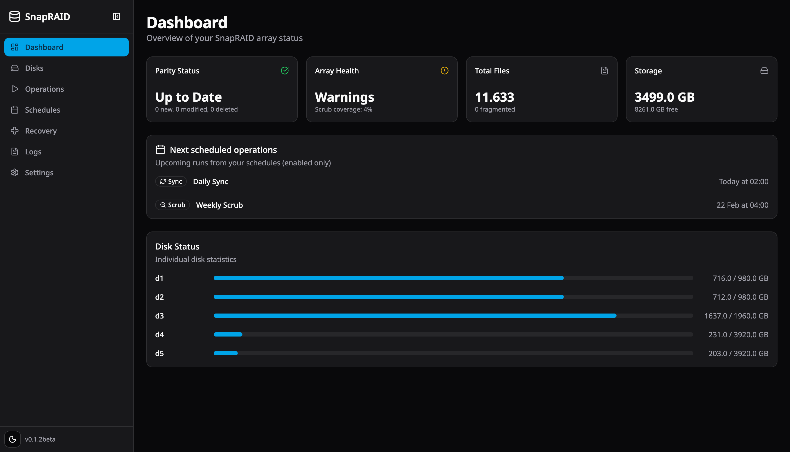
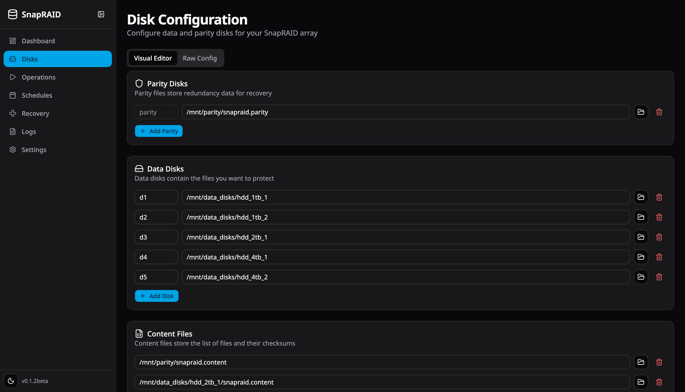
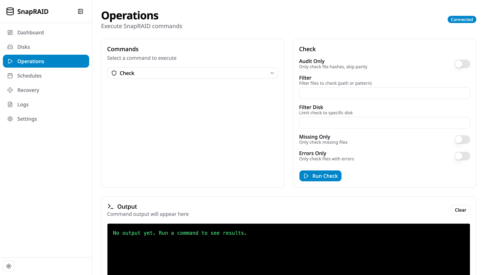
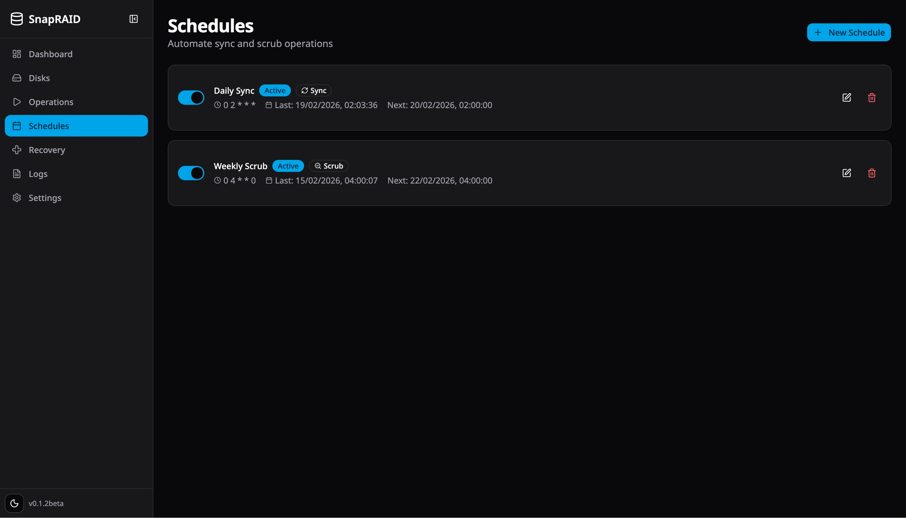
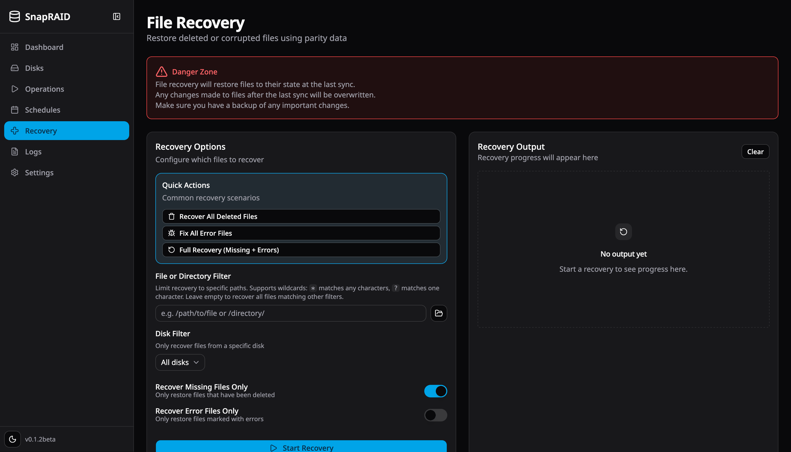
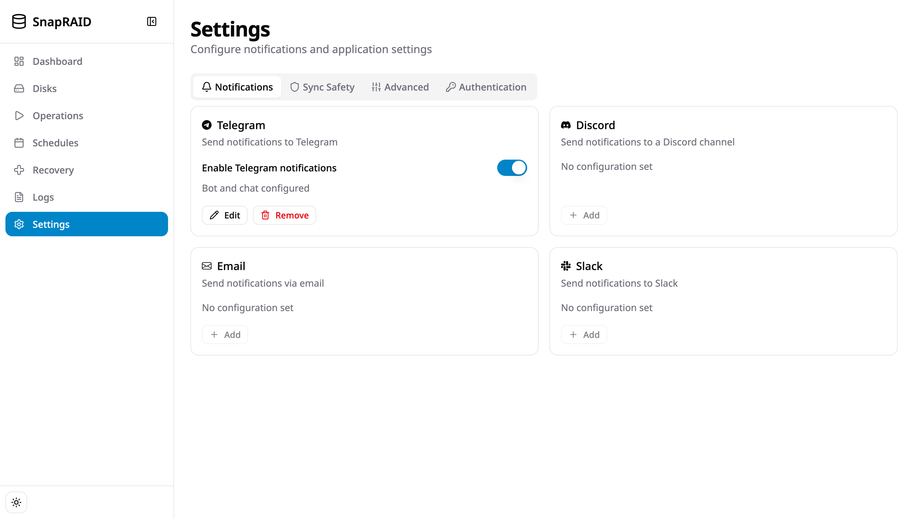

# SnapRAID Web UI

[](https://github.com/httpiga/snapraid-webui/actions/workflows/docker-build.yml)
[](https://codecov.io/github/httpiga/snapraid-webui)
[](https://github.com/httpiga/snapraid-webui/blob/master/LICENSE.md)
[](https://github.com/prettier/prettier)

A modern, self-hosted web interface for managing [SnapRAID](https://www.snapraid.it/) installations. SnapRAID is a backup program for disk arrays that stores parity information and allows recovery from disk failures. Execute commands, manage configurations, schedule operations, and receive notifications—all through your browser.

## Table of Contents

- [Features](#features)
- [Screenshots](#screenshots)
- [Quick Start](#quick-start)
- [Environment Variables](#environment-variables)
- [Development](#development)
- [Tech Stack](#tech-stack)
- [License](#license)

## Features

- **Dashboard** - Real-time status overview, array status, and disk usage
- **Disk Management** - Configure data and parity disks through visual or raw editor
- **Command Execution** - Run sync, scrub, check, fix, and more with live output streaming
- **Scheduling** - Automate sync and scrub operations with cron-based scheduling
- **File Recovery** - Browse and restore accidentally deleted files
- **Logs** - View and delete command output logs
- **Notifications** - Get alerts via Discord, Telegram, Slack, or Email
- **Sync Safety** - Configure pre-hash, force-empty, and limits for sync operations (Settings)
- **Advanced** - Spin-down on error, bandwidth limit, and other SnapRAID options (Settings)
- **Optional Auth** - Protect your instance with username/password authentication
- **Light/Dark theme** - Theme toggle in the sidebar

## Screenshots

| Dashboard                                    | Disks                                | Operations                                     |
| -------------------------------------------- | ------------------------------------ | ---------------------------------------------- |
|  |  |  |

| Schedules                                    | Recovery                                   | Settings                                   |
| -------------------------------------------- | ------------------------------------------ | ------------------------------------------ |
|  |  |  |

## Quick Start

### Using Docker (Recommended)

The Docker image includes SnapRAID, so you do not need to install it on the host or mount the binary.

1. Create a `docker-compose.yml`:

```yaml
services:
  snapraid-webui:
    image: ghcr.io/httpiga/snapraid-webui:latest
    container_name: snapraid-webui
    restart: unless-stopped
    volumes:
      # Persistent config folder (required)
      - ./config:/app/config
      # Mount your data disks (adjust to your setup)
      - /mnt/disk1:/mnt/disk1
      - /mnt/disk2:/mnt/disk2
      - /mnt/disk3:/mnt/disk3
      # Mount your parity disk(s)
      - /mnt/parity:/mnt/parity
    ports:
      - "3000:3000"
    environment:
      - TZ=Europe/Rome
```

2. Start the container:

```bash
docker compose up -d
```

3. Open http://localhost:3000 in your browser

Config and logs are stored under the mounted config folder (e.g. `./config`), so they persist across container restarts.

**SMART unavailable in Docker.** When running in Docker, SnapRAID's SMART command and device listing are not available; the web UI does not offer the SMART command in this setup.

> SMART and SnapRAID's devices/smart features require mapping filesystem mountpoints to real block devices via /sys (major:minor → /dev/sdX). In Docker containers the root filesystem is typically an overlay mount (e.g., 0:70), which cannot be dereferenced to a physical block device, so SnapRAID reports "Device listing/SMART unsupported" and the SMART commands cannot be relied on in this environment.

### Environment Variables

| Variable             | Description                                                                 | Default             |
| -------------------- | --------------------------------------------------------------------------- | ------------------- |
| `TZ`                 | Timezone                                                                    | `UTC`               |
| `PORT`               | Port the server listens on                                                  | `3000`              |
| `AUTH_ENABLED`       | Enable authentication                                                       | `false`             |
| `AUTH_USERNAME`      | Username for auth                                                           | `admin`             |
| `AUTH_PASSWORD_HASH` | Bcrypt hash of password (see below)                                         | -                   |
| `SESSION_SECRET`     | Secret for session cookies (auto-generated if not set when auth is enabled) | -                   |
| `CONFIG_PATH`        | Path to config directory                                                    | `/app/config`       |
| `SNAPRAID_BIN`       | Path to snapraid binary (image includes SnapRAID at `/usr/bin/snapraid`)    | `/usr/bin/snapraid` |

To generate `AUTH_PASSWORD_HASH`, run:

```bash
docker run --rm -it node:22-alpine -e "console.log(require('bcryptjs').hashSync('YOUR_PASSWORD', 10))"
```

Use the printed hash as the value for `AUTH_PASSWORD_HASH`.

## Development

### Prerequisites

- [Bun](https://bun.sh/) >= 1.0
- SnapRAID installed on your system

### Setup

```bash
# Clone the repository
git clone https://github.com/httpiga/snapraid-webui.git
cd snapraid-webui

# Install dependencies
bun install

# Start development servers
bun run dev
```

- Frontend: http://localhost:5173
- Backend: http://localhost:3000

### Local dev: virtual disks (macOS)

SnapRAID requires content files on **different disks** (different devices). Using plain folders under `mock-disks/` makes SnapRAID treat them as the same disk and report: "Content files on the same disk".

To satisfy SnapRAID locally without real disks, use three **virtual disk images** (macOS only):

```bash
# Create 3 sparse disk images, mount at mock-disks/, seed sample files
bun run virtual-disks:setup

# When done (optional): unmount; images stay in .virtual-disk-images/
bun run virtual-disks:teardown
```

## Tech Stack

- **Runtime**: Bun
- **Backend**: Express
- **Frontend**: React 19, Vite, React Router v7
- **UI**: shadcn/ui, Tailwind CSS
- **State**: Redux Toolkit + RTK Query
- **Scheduling**: node-cron

## License

[MIT](LICENSE.md)
